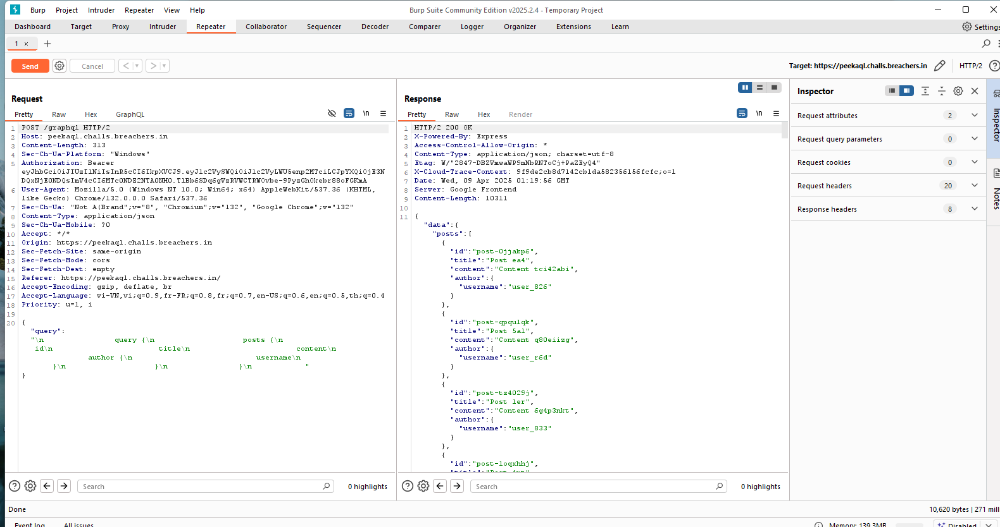
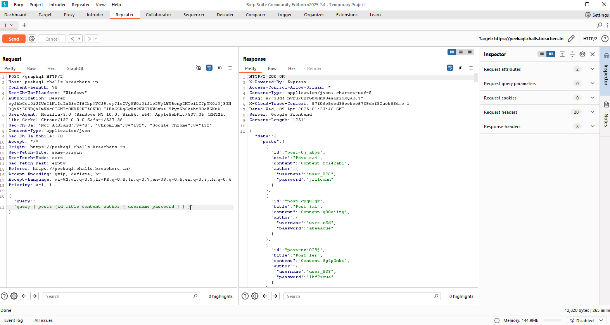

Theo tên đề ta thấy đc gợi ý được dùng Grqphql để viết truy vấn 

Như hình ta thấy có query như trên gồm id title và cả username. Hãy thử thêm cả password vào cả query

Như vậy chỉ tìm username = admin là có thể login vào và thấy flag.